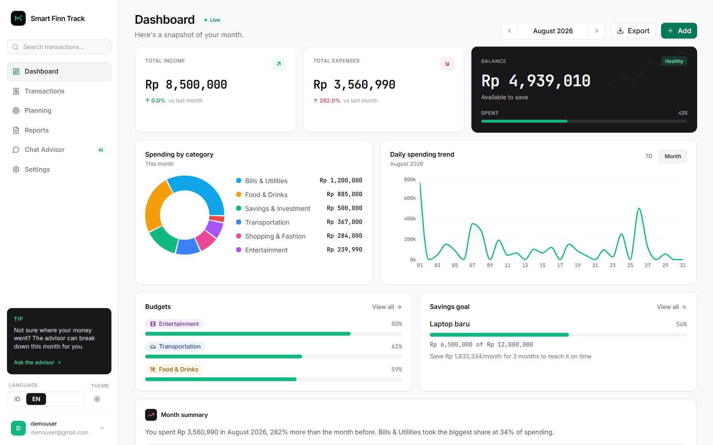
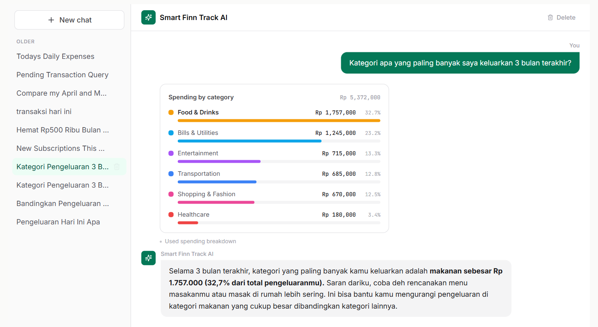
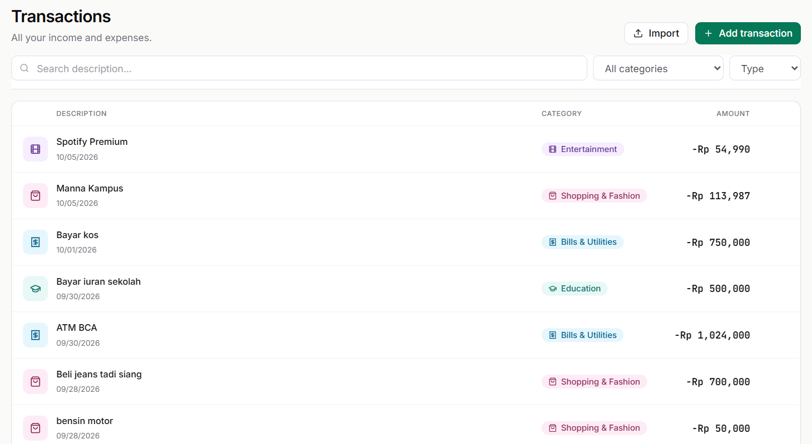
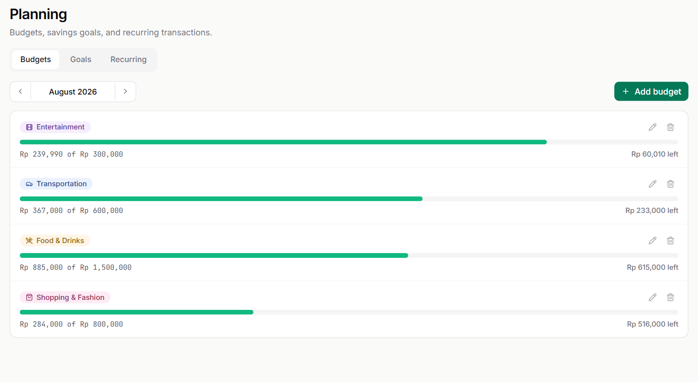

<!-- Generated by scripts/render_readme.py. Edit the generator, not this snapshot. -->

<h3>filan214@github:~$ git contributions --calendar</h3>

 

 

<h3>filan214@github:~$ contact --reach</h3>

Got a project, a role, or a data question? Pick a channel.

 

 

<h3>filan214@github:~$ git portfolio --latest</h3>

<a href="https://github.com/filan214/netflix-gap-analysis">↗ Explore code</a> &nbsp; · &nbsp; <a href="https://github.com/filan214/netflix-gap-analysis/commit/fb68d12504ef3b1308d06f1b8e708e4464f8d37b">↗ Latest commit</a> &nbsp; · &nbsp; <a href="https://github.com/filan214/netflix-gap-analysis/commits">↗ Commit history</a>

<h3>filan214@github:~$ showcase --data-science · Customer Propensity &amp; Targeting</h3>

See the call list in Tableau

 

<a href="https://public.tableau.com/app/profile/valentinus.gunawan/viz/DealershipCross-SellPropensityDashboard/Dashboard1">↗ Open Tableau dashboard</a> &nbsp; · &nbsp; <a href="https://github.com/filan214/dealership-crosssell-propensity">↗ Explore project</a> &nbsp; · &nbsp; <a href="https://github.com/filan214/dealership-crosssell-propensity/blob/56a1e0d6f569fe9a93ae5c1c0b1087f1724a8a25/notebooks/01_model.ipynb">↗ Inspect model notebook</a>

Public Kaggle data reframed as a dealership case, not client data

Inspect source evidence

 

 

<h3>filan214@github:~$ showcase --finance · AI for everyday money</h3>

<a href="https://ai-finance-tracker-delta-drab.vercel.app/"><picture><source media="(prefers-color-scheme: dark)" srcset="./screens/finance-dashboard-dark.png"></picture></a>

<table width="860"><tr><td width="33%" align="center" valign="top"><a href="https://github.com/filan214/filan214/blob/main/screens/finance-chat-light.png"><picture><source media="(prefers-color-scheme: dark)" srcset="./screens/finance-chat-dark.png"></picture></a> <b>AI advisor</b> Answers from your own rows, chart included</td><td width="33%" align="center" valign="top"><a href="https://github.com/filan214/filan214/blob/main/screens/finance-transactions-light.png"><picture><source media="(prefers-color-scheme: dark)" srcset="./screens/finance-transactions-dark.png"></picture></a> <b>Transactions</b> Auto-categorized history with search and filters</td><td width="33%" align="center" valign="top"><a href="https://github.com/filan214/filan214/blob/main/screens/finance-planning-light.png"><picture><source media="(prefers-color-scheme: dark)" srcset="./screens/finance-planning-dark.png"></picture></a> <b>Planning</b> Monthly budgets with live progress</td></tr></table>

Screens from the live demo's sample account · captured 06 Oct 2026

<strong>Smart Finn Track</strong> brings an AI advisor, spending insights, and monthly reports into a personal finance app. Try the live demo in one click, then follow the code behind it.

<a href="https://ai-finance-tracker-delta-drab.vercel.app/">↗ Open app</a> &nbsp; · &nbsp; <a href="https://github.com/filan214/AIFinanceTracker">↗ Explore AIFinanceTracker</a> &nbsp; · &nbsp; <a href="https://github.com/filan214/AIFinanceTracker/commit/552a0f442c668188bf9ab5d2dc307b2a69b93033">↗ Latest source commit</a>

Inspect source evidence

 

 

<h3>filan214@github:~$ ps --repos</h3>

<table width="860"><tr><th width="27%" align="left">Repository</th><th width="15%" align="left">Code</th><th width="25%" align="left">Commits · 28d</th><th width="19%" align="left">Last push (UTC)</th><th width="14%" align="left">Explore</th></tr>

<tr><td><a href="https://github.com/filan214/netflix-gap-analysis">netflix-gap-analysis</a></td><td>Jupyter Notebook</td><td></td><td>2026-10-07</td><td><a href="https://github.com/filan214/netflix-gap-analysis/commit/fb68d12504ef3b1308d06f1b8e708e4464f8d37b">Commit</a></td></tr>

<tr><td><a href="https://github.com/filan214/AIFinanceTracker">AIFinanceTracker</a></td><td>TypeScript</td><td></td><td>2026-10-06</td><td><a href="https://github.com/filan214/AIFinanceTracker/commit/552a0f442c668188bf9ab5d2dc307b2a69b93033">Commit</a> · <a href="https://ai-finance-tracker-delta-drab.vercel.app">Site</a></td></tr>

<tr><td><a href="https://github.com/filan214/dealership-crosssell-propensity">dealership-crosssell-propensity</a></td><td>Jupyter Notebook</td><td></td><td>2026-09-30</td><td><a href="https://github.com/filan214/dealership-crosssell-propensity/commit/56a1e0d6f569fe9a93ae5c1c0b1087f1724a8a25">Commit</a></td></tr>

<tr><td><a href="https://github.com/filan214/F1---2026-Car-Details">F1---2026-Car-Details</a></td><td>JavaScript</td><td></td><td>2026-09-11</td><td><a href="https://github.com/filan214/F1---2026-Car-Details/commit/71fafa72b34bfbed07a01d8bc93b969246e7b4e2">Commit</a></td></tr>

</table>

28-day default-branch activity · all authors · each line scaled to its own peak

 

Read all 10 pushes &amp; open commits

 

<table width="860"><tr><th align="left" width="20%">Pushed (UTC)</th><th align="left" width="25%">Repository / branch</th><th align="left" width="55%">Head commit</th></tr>

<tr><td>2026-10-06 07:31:39</td><td><a href="https://github.com/filan214/AIFinanceTracker">filan214/AIFinanceTracker</a> main</td><td><a href="https://github.com/filan214/AIFinanceTracker/commit/552a0f442c668188bf9ab5d2dc307b2a69b93033">552a0f4</a> chore: stop tracking PRD.md (kept locally, now gitignored)</td></tr>

<tr><td>2026-10-06 07:29:49</td><td><a href="https://github.com/filan214/AIFinanceTracker">filan214/AIFinanceTracker</a> main</td><td><a href="https://github.com/filan214/AIFinanceTracker/commit/7735701a462ac76f3507172da76528e8c73d2a51">7735701</a> docs(readme): rewrite for portfolio: demo walkthrough, engineering highlights, current stack</td></tr>

<tr><td>2026-10-05 18:48:53</td><td><a href="https://github.com/filan214/AIFinanceTracker">filan214/AIFinanceTracker</a> main</td><td><a href="https://github.com/filan214/AIFinanceTracker/commit/db9e9c33455aa6ba5b12c99bbd7c78d99f065cda">db9e9c3</a> fix(pdf): align report table headers with their columns; keep Saved&#x27;s minus</td></tr>

<tr><td>2026-10-05 18:04:55</td><td><a href="https://github.com/filan214/AIFinanceTracker">filan214/AIFinanceTracker</a> main</td><td><a href="https://github.com/filan214/AIFinanceTracker/commit/1a858b556ad8d5724acba2f02a4a5238c359c643">1a858b5</a> docs: handoff + progress for the 2026-10-06 UI/UX refinement pass</td></tr>

<tr><td>2026-09-30 18:33:04</td><td><a href="https://github.com/filan214/dealership-crosssell-propensity">filan214/dealership-crosssell-propensity</a> main</td><td><a href="https://github.com/filan214/dealership-crosssell-propensity/commit/56a1e0d6f569fe9a93ae5c1c0b1087f1724a8a25">56a1e0d</a> Add &quot;How it works&quot; section, dataset link and clean Tableau link</td></tr>

<tr><td>2026-09-30 18:23:03</td><td><a href="https://github.com/filan214/dealership-crosssell-propensity">filan214/dealership-crosssell-propensity</a> main</td><td><a href="https://github.com/filan214/dealership-crosssell-propensity/commit/9e4d1471bd79ac90cfd36b9ca095071ec7ac6fd1">9e4d147</a> Add Tableau Public link to dashboard section</td></tr>

<tr><td>2026-09-29 18:54:18</td><td><a href="https://github.com/filan214/AIFinanceTracker">filan214/AIFinanceTracker</a> main</td><td><a href="https://github.com/filan214/AIFinanceTracker/commit/40020aaca9d79014980e8f211bb2f3f330c6e6c2">40020aa</a> docs: mark all 2026-09-30 work pushed + deployed; correct quota claim (limit 20 is likely per-minute, not per-day)</td></tr>

<tr><td>2026-09-29 18:45:41</td><td><a href="https://github.com/filan214/AIFinanceTracker">filan214/AIFinanceTracker</a> main</td><td><a href="https://github.com/filan214/AIFinanceTracker/commit/d4e863fe25ea3964c1244812e1a2a19b074da526">d4e863f</a> docs: receipt busy/unreadable split done; refresh push + test counts</td></tr>

<tr><td>2026-09-29 18:18:08</td><td><a href="https://github.com/filan214/AIFinanceTracker">filan214/AIFinanceTracker</a> main</td><td><a href="https://github.com/filan214/AIFinanceTracker/commit/87f6fb6886f88739688aaace359493394aa30a4d">87f6fb6</a> feat: switch AI from OpenRouter free model to Gemini 3.5 Flash (Google AI Studio)</td></tr>

<tr><td>2026-09-29 10:22:45</td><td><a href="https://github.com/filan214/AIFinanceTracker">filan214/AIFinanceTracker</a> main</td><td><a href="https://github.com/filan214/AIFinanceTracker/commit/2b51c2d4efd51e1007669818b37c5e1810a99538">2b51c2d</a> docs: click-through verification done — all 5 UI fixes PASS on prod</td></tr>

</table>

Public push events by filan214 across repositories and branches. GitHub exposes a limited event window and may delay events; fewer than ten results are shown when that is all it supplies. Profile automation and configured exclusions are omitted.

Push feed synced: 08 Oct 2026 · 03:37 WIB · <a href="https://github.com/filan214/filan214/blob/main/data/commit-stream.json">Inspect source snapshot</a>

 

<h3>filan214@github:~$ languages --bytes</h3>

 

 

<h3>filan214@github:~$ sources --inspect · Data sources &amp; freshness</h3>

Refreshed hourly at minute 17 · also on profile pushes and manual runs

Inspect sources, measurement scope &amp; refresh behavior

 

<table width="860"><tr><th align="left">Snapshot</th><th align="left">What it measures</th></tr>

<tr><td><a href="https://github.com/filan214/filan214/blob/main/data/builds.json">Projects &amp; activity</a></td><td>Public repository metadata and 28-day default-branch commit history, all authors. Synced 08 Oct 2026 · 03:37 WIB.</td></tr>

<tr><td><a href="https://github.com/filan214/filan214/blob/main/data/commit-stream.json">Cross-repo pushes</a></td><td>Available public push events by filan214; one exact head commit per push. Synced 08 Oct 2026 · 03:37 WIB.</td></tr>

<tr><td><a href="https://github.com/filan214/filan214/blob/main/data/highlights.json">Finance &amp; cross-sell spotlights</a></td><td>File inventories pinned to the displayed source commit, cross-sell results quoted from that project&#x27;s README at the same commit, 90-day commit history, latest public workflow observation, and a public finance landing-page check.</td></tr>

<tr><td><a href="https://github.com/filan214/filan214/blob/main/data/contributions.json">Contribution calendar</a></td><td>GitHub contribution HTML: full account totals, including automation.</td></tr>

<tr><td><a href="https://github.com/filan214/filan214/blob/main/data/languages.json">Language mix</a></td><td>GitHub Linguist byte counts from eligible public repositories. Code proportions, not proficiency.</td></tr>

<tr><td><a href="https://github.com/filan214/filan214/blob/main/screens/manifest.json">Finance screenshots</a></td><td>Static captures of the public demo account (August 2026 data), taken 06 Oct 2026 by scripts/capture_finance_screens.js. Not refreshed hourly.</td></tr>

</table>

Project selection and aggregate languages exclude this profile repository, configured exclusions, forks, and archives. The two curated spotlights follow AIFinanceTracker and dealership-crosssell-propensity while they remain public and active.

Source counts show files and registered tools, not passed tests or feature-health checks. Workflow results identify their commit. The cross-sell card shows source structure and commit history; its model results are quoted from the project README, not recomputed here. The finance app check only tests its public landing page, without accessing an account or financial data.

GitHub schedules, event delivery, source analysis, and image caches can delay updates. A failed refresh keeps the last published snapshot and its recorded timestamps. The portrait is supplied by Filan.

<a href="https://github.com/filan214/filan214/actions/workflows/update-profile-art.yml">↗ Refresh workflow</a> &nbsp; · &nbsp; <a href="https://github.com/filan214/filan214/tree/main/scripts">↗ Explore the generators</a>

